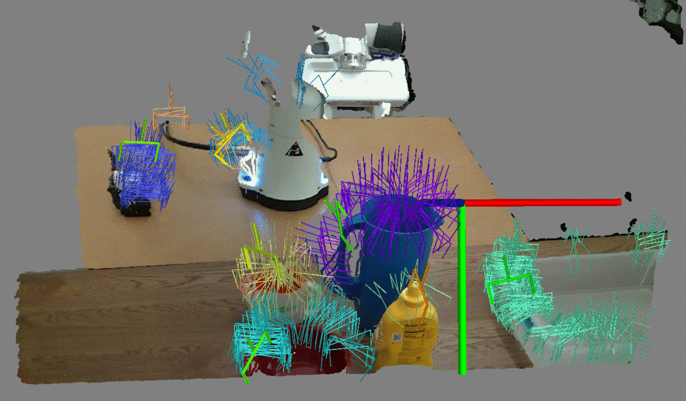
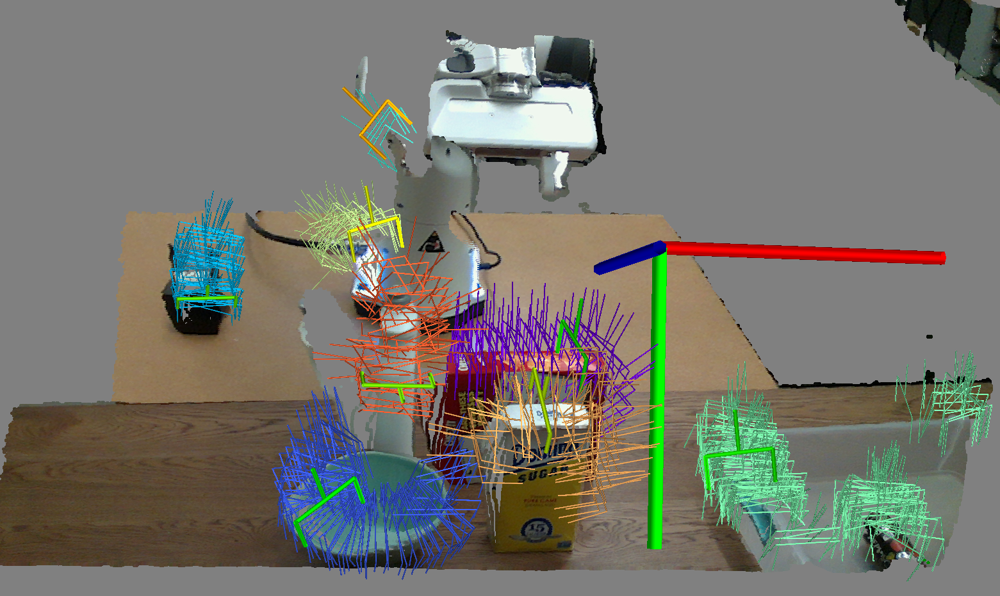

# Contact-GraspNet  

### Contact-GraspNet: Efficient 6-DoF Grasp Generation in Cluttered Scenes   
Martin Sundermeyer, Arsalan Mousavian, Rudolph Triebel, Dieter Fox  
ICRA 2021    

[paper](https://arxiv.org/abs/2103.14127), [project page](https://research.nvidia.com/publication/2021-03_Contact-GraspNet%3A--Efficient), [video](http://www.youtube.com/watch?v=qRLKYSLXElM)

<p align="center">
  
</p>

## Installation

This code has been tested with python 3.7, tensorflow 2.2, CUDA 11.1

Create the conda env
```
conda env create -f contact_graspnet_env.yml
```

### Troubleshooting

- Recompile pointnet2 tf_ops:
```shell
sh compile_pointnet_tfops.sh
```

### Hardware
Training: 1x Nvidia GPU >= 24GB VRAM, >=64GB RAM  
Inference: 1x Nvidia GPU >= 8GB VRAM (might work with less)

## Download Models and Data
### Model
Download trained models from [here](https://drive.google.com/drive/folders/1tBHKf60K8DLM5arm-Chyf7jxkzOr5zGl?usp=sharing) and copy them into the `checkpoints/` folder.
### Test data
Download the test data from [here](https://drive.google.com/drive/folders/1v0_QMTUIEOcu09Int5V6N2Nuq7UCtuAA?usp=sharing) and copy them them into the `test_data/` folder.

## Inference


Contact-GraspNet can directly predict a 6-DoF grasp distribution from a raw scene point cloud. However, to obtain object-wise grasps, remove background grasps and to achieve denser proposals it is highly recommended to use (unknown) object segmentation [e.g. [1](https://github.com/chrisdxie/uois), [2](https://arxiv.org/abs/2103.06796)] as preprocessing and then use the resulting segmentation map to crop local regions and filter grasp contacts.

Given a .npy/.npz file with a depth map (in meters), camera matrix K and (optionally) a 2D segmentation map, execute:

```shell
python contact_graspnet/inference.py \
       --np_path=test_data/*.npy \
       --local_regions --filter_grasps
```

<p align="center">
  
</p>
--> close the window to go to next scene

Given a .npy/.npz file with just a 3D point cloud (in meters), execute [for example](examples/realsense_crop_sigma_001.png):
```shell
python contact_graspnet/inference.py --np_path=/path/to/your/pc.npy \
                                     --forward_passes=5 \
                                     --z_range=[0.2,1.1]
```

`--np_path`: input .npz/.npy file(s) with 'depth', 'K' and optionally 'segmap', 'rgb' keys. For processing a Nx3 point cloud instead use 'xzy' and optionally 'xyz_color' as keys.  
`--ckpt_dir`: relative path to checkpooint directory. By default `checkpoint/scene_test_2048_bs3_hor_sigma_001` is used. For very clean / noisy depth data consider `scene_2048_bs3_rad2_32` / `scene_test_2048_bs3_hor_sigma_0025` trained with no / strong noise.   
`--local_regions`: Crop 3D local regions around object segments for inference. (only works with segmap)  
`--filter_grasps`: Filter grasp contacts such that they only lie on the surface of object segments. (only works with segmap)  
`--skip_border_objects` Ignore segments touching the depth map boundary.  
`--forward_passes` number of (batched) forward passes. Increase to sample more potential grasp contacts.  
`--z_range` [min, max] z values in meter used to crop the input point cloud, e.g. to avoid grasps in the foreground/background(as above).  
`--arg_configs TEST.second_thres:0.19 TEST.first_thres:0.23` Overwrite config confidence thresholds for successful grasp contacts to get more/less grasp proposals 


## Training

### Download Data 

Download the Acronym dataset, ShapeNet meshes and make them watertight, following these [steps](https://github.com/NVlabs/acronym#using-the-full-acronym-dataset).

Download the training data consisting of 10000 table top training scenes with contact grasp information from [here](https://drive.google.com/drive/folders/1eeEXAISPaStZyjMX8BHR08cdQY4HF4s0?usp=sharing) and extract it to the same folder:

```
acronym
├── grasps
├── meshes
├── scene_contacts
└── splits
```

### Train Contact-GraspNet

When training on a headless server set the environment variable
```shell
export PYOPENGL_PLATFORM='egl'
```

Start training with config `contact_graspnet/config.yaml`
```
python contact_graspnet/train.py --ckpt_dir checkpoints/your_model_name \
                                 --data_path /path/to/acronym/data
```

### Generate Contact Grasps and Scenes yourself (optional)

The `scene_contacts` downloaded above are generated from the Acronym dataset. To generate/visualize table-top scenes yourself, also pip install the [acronym_tools]((https://github.com/NVlabs/acronym)) package in your conda environment as described in the acronym repository.

In the first step, object-wise 6-DoF grasps are mapped to their contact points saved in `mesh_contacts`

```
python tools/create_contact_infos.py /path/to/acronym
```

From the generated `mesh_contacts` you can create table-top scenes which are saved in `scene_contacts` with

```
python tools/create_table_top_scenes.py /path/to/acronym
```

Takes ~3 days in a single thread. Run the command several times to process on multiple cores in parallel.

You can also visualize existing table-top scenes and grasps

```
python tools/create_table_top_scenes.py /path/to/acronym \
       --load_existing scene_contacts/000000.npz -vis
```

## Citation

```
@article{sundermeyer2021contact,
  title={Contact-GraspNet: Efficient 6-DoF Grasp Generation in Cluttered Scenes},
  author={Sundermeyer, Martin and Mousavian, Arsalan and Triebel, Rudolph and Fox, Dieter},
  booktitle={2021 IEEE International Conference on Robotics and Automation (ICRA)},
  year={2021}
}
```
